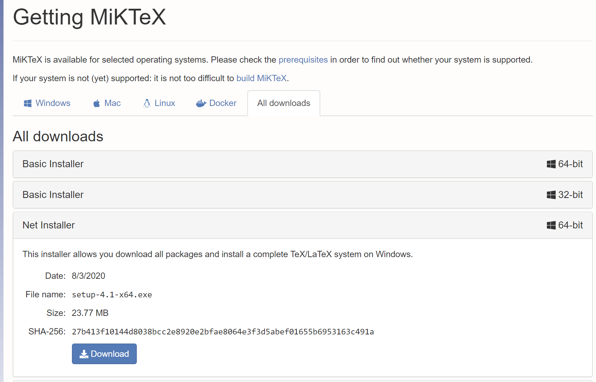
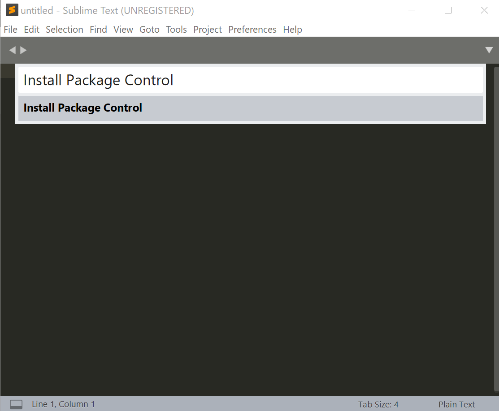
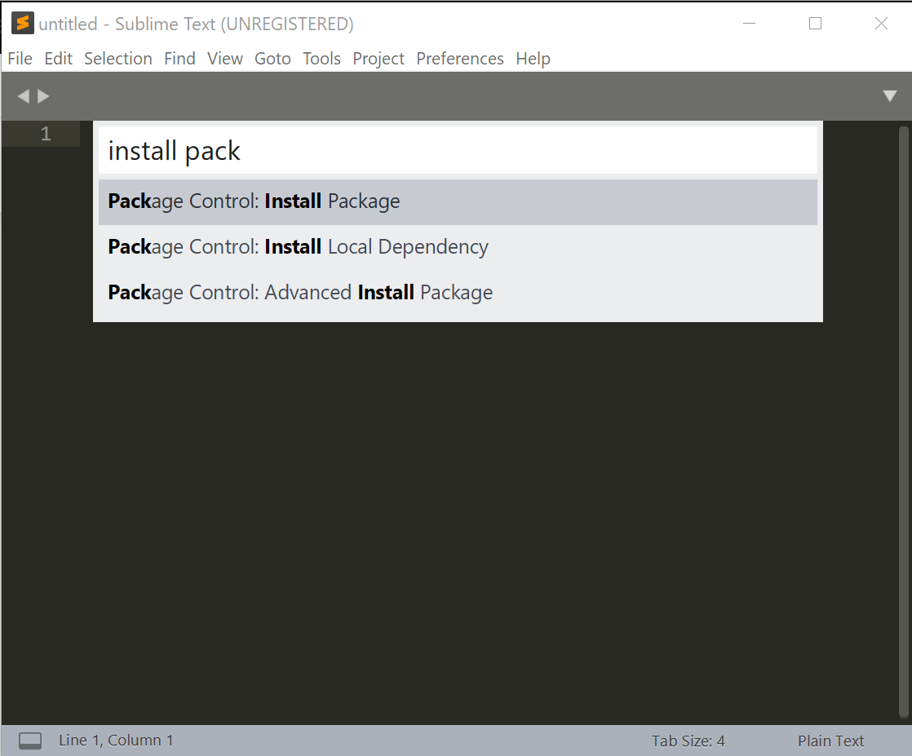
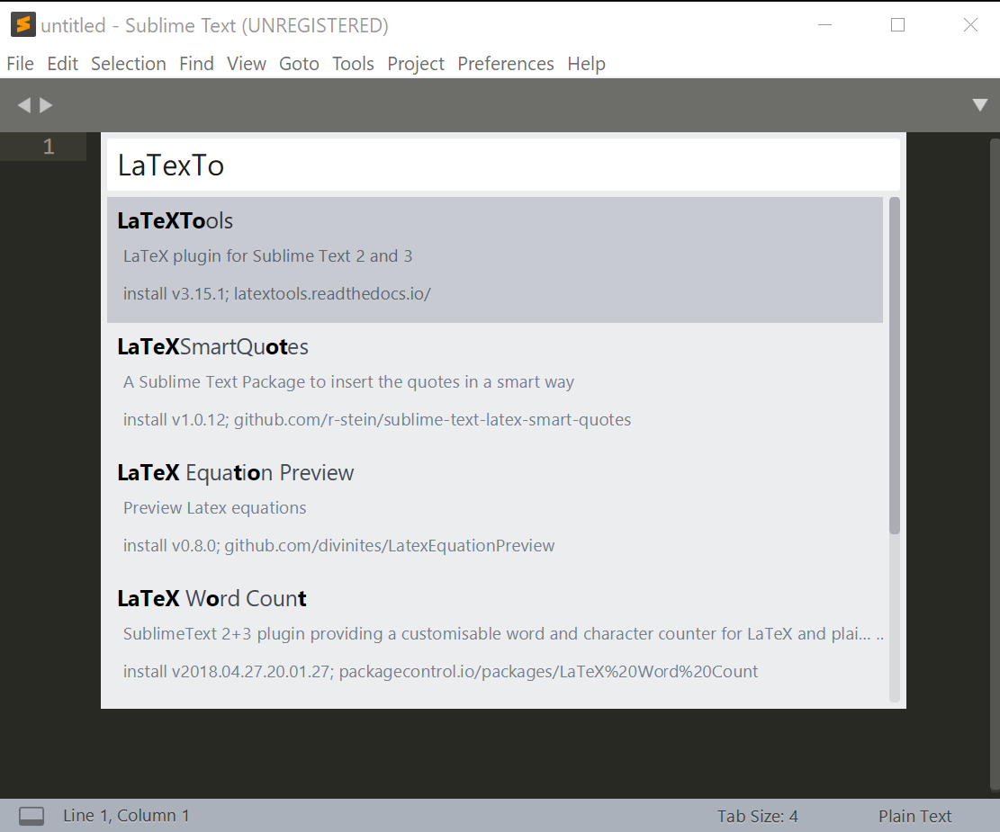
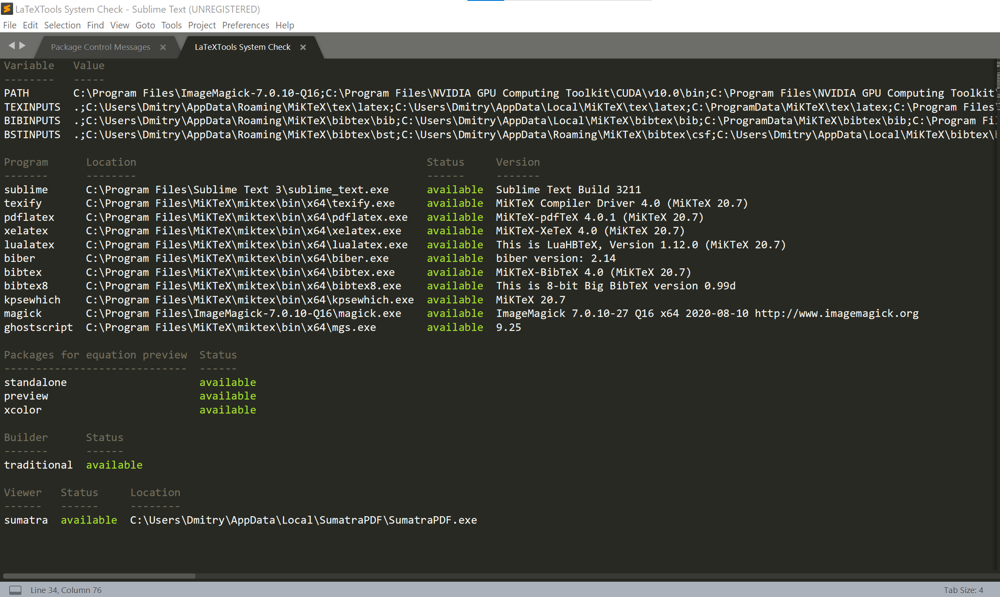

### Sublime Text and LaTeX Installation Guide: Windows

This guide covers installation and configuration of Sublime Text and LaTeX on Windows (tested on Windows 10 64 bit).

1. Download MiKTeX Installer: go to [https://miktex.org/download](https://miktex.org/download), choose the `All downloads` tab and download the Net Installer. 

2. Download MiKTeX Packages: run the installer, then choose `Download MiKTeX`, then `Complete MiKTeX`, then choose the server from which the data will be downloaded. Finally choose the directory, and start the download.

3. Run the installer once again but this time choose `Install MiKTeX`, then `Complete MiKTeX`, then choose `Install MiKTeX for anyone who uses this computer`. In the `Install MiKTeX from` field choose the folder where you downloaded MiKTeX files in the previous step. Finally, set the folder to install MiKTeX to. In the dropdown menu `Install missing packages on-the-fly` select `Yes` then click `Start`.

4. Download and install [Sumatra PDF](https://www.sumatrapdfreader.org/download-free-pdf-viewer.html)

5. Go to [https://ghostscript.com/download/gsdnld.html](https://ghostscript.com/download/gsdnld.html), download and install ghostsciprt:

6. Download and install ImageMagick, go to [http://www.imagemagick.org/script/download.php](http://www.imagemagick.org/script/download.php) scroll down to 'Windows Binary Release' and get the Q16-x64-static installer (highlighted on the image below), don't forget to check the box `Add application directory to your system path`:

7. Install Sublime Text 3 : go to [https://www.sublimetext.com/3](https://www.sublimetext.com/3) then download and run the Windows 64 bit installer.

8. Open Sublime Text, and press `Ctrl + Shift + P`. Type in `Install Package Control` and press `Enter`.

9. Press `Ctrl + Shift + P` once again and type in `Package Control: Install Package`, press `Enter`.

10. Type in `LaTeXTools` and press `Enter`

11. Go to `Prefernces -> Package Settings -> LaTeXTools` and press `Check System`. You should see something like this:

If some components are missing, make sure that their rescpective executables are added to the `PATH` system variable.