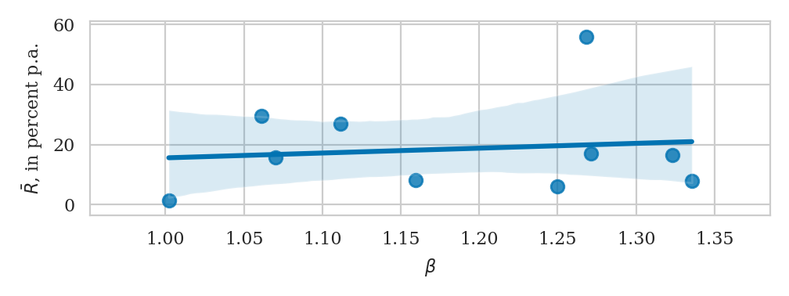

# reproducibility

## notebooks
### what are (jupyter) notebooks?
The Jupyter Notebook is an app that runs within a web browser and allows us to create and share interactive documents that contain code, visualizations, equations and explanatory text. Jupyter has evolved from IPython and now accommodates many different programming languages: R, Julia, C++, etc. Jupyter is open source.

### why jupyter?
Notebooks are easy to share and are a perfect medium to communicate the exact step-by-step process leading to the results of a research project. Hence their importance for reproducibility. Notebooks are interactive and hence provide a high didactic value allowing the target audience to better grasp the core concepts of research given hands-on examples.

### installation
To run jupyter notebooks you need a Python installation. The recommended way is to install Anaconda distribution which comes with pre-packaged jupyter along with a suite of tools for data science. For other configurations check [the official documentation](https://jupyter.org/install).

### starting a new notebook
To start a notebook open the command prompt, then navigate to the directory you will be working in and type in `jupyter notebook`. The command will start a notebook server which should be running while you are working in the notebook. For additional information like running the server using a custom IP or port, refer to [this page](https://jupyter.readthedocs.io/en/latest/running.html). The notebook will run in your browser. The first thing you see will be a dashboard where you can navigate in different directories and create new notebooks.

Happy coding!

## interactive apps
### R shiny
The following is based on the [video tutorial](https://shiny.rstudio.com/tutorial/) and [documentation](https://shiny.rstudio.com/articles/basics.html) you are encouraged to sit through.

An `R shiny` app is a webpage that contains `R` components. Attached to it a server with an open session of `R`, such that the moment the user changes inputs on the webpage, these changes are passed on to `R` and reflected in the output. `R shiny` apps wrap the functionality of `R` in a pretty HTML/CSS design without the coder having to know much of HTML and CSS. You can create an entire page using nothing but R!

For a researcher who uses `R` to do the coding, `R shiny` is a marginally inexpensive step to give voice to their research project. As an example, consider a toy exercise of detecting the relation between stocks' market betas and expected returns. You have performed the calculations and present the results as follows:



When observing a graph like this, the audience might start asking questions:<br>
&ndash; What happens if you change the estimation window? <br>
&ndash; What is the stock over there with 60% average return? <br>
&ndash; How would excluding this stock change the results?

Now, imagine you could make the chart able to answer these questions. This is what an interactive app could indeed accomplish, as showcased here: [https://ipozdeev.shinyapps.io/r-shiny-tutorial/](https://ipozdeev.shinyapps.io/r-shiny-tutorial/).

### app structure
Although there are several ways to create an R shiny app, we would not go beyond writing it familiarly in an `.R` script. This script almost always has the following basic structure:
```
library(shiny)

# user interface is defined here
ui <- fluidPage()

# what your computer/server does is defined here
server <- function(input, output) {}

# this runs the app with the UI and server logic
shinyApp(ui = ui, server = server)

```
Just like in any app, two things need to be defined: a user interface, or how the app appears on the outside and talks with the user; and the engine, or how the app works on the inside. The user interface is defined in `fluidPage()`. This function simply creates a bunch of lines of HTML code for you, based on the arguments. You could have written these lines yourself, but `R` is ready to help you out here. The engine is written as a function operating on two arguments: `input` and `output`. If you run the above few lines of code, `R` will command your web browser to fire up and produce a web page with HTML written by the empty `fluidPage` call (hence a blank page).

### how server and ui talk
The server and the UI communicate via the former's arguments `input` and `output` facilitated by a `reactive` environment.

Inputs flow from the UI to the server: these are variables that the user of the app can toggle. `Shiny` offers many ways to do so: sliders, radio boxes, drop-out menus and so on, each being a function ending in `...Input`. Again, behind those is just some HTML code produced by `R`. The input functions assign elements to container `input` &ndash; the first argument of `server` function above. For instance, `selectInput("frequency", ...)` is a drop-out menu with the choice being passed to the server as `input$frequency`.

Output functions, producing the reverse information flow and ending in `...Output`, are similar. For instance, `plotlyOutput("plot")` on the UI side would produce a plot based on `output$plot` to be found on the server side. Hence, all you need to do to show a plot is to render it within `server` and store as `output$plot`, then fetch it somewhere in `ui`.

One important feature of this communication is reactivity. Whenever an input value changes, for instance, when the slider is moved or a different element selected from a drop-out menu, this change must be passed on downstream to the receiver of this input. Unless the receiver is capable of understanding the change, the change is useless. Simple `R` functions, such as `plot_ly()`, are unable to understand this, which is the reason reactive functions, such as `renderPlotly`, are needed here, otherwise an error will be raised.

Here is the source of the betas-vs-returns app:
```
# UI is a fluid environment with (1) a title, (2) a sidebar with controls and
#   (3) a main plotting area
ui <- fluidPage(
  # (1) draw a panel containing the title as a h1-level header.
  titlePanel(h1("market betas vs. average returns")),

  sidebarLayout(
    # (2) controls with an h2-level header
    sidebarPanel(
      h2("controls"),
      br(),
      selectInput("frequency",
                  label = "select frequency",
                  choices = list("daily" = "daily",
                                 "monthly" = "monthly",
                                 "yearly" = "yearly"),
                  selected = "daily"),
    ),
    # (3) plotting area with an h2-level header
    mainPanel(
      h2("results"),
      plotlyOutput("plot")
    )
  )
)

# server logic: 1) fetch the data, 2) calculate betas based on the input from
#   controls above, 3) render a plot
server <- function(input, output) {
  # get data
  r <- get_stock_data()

  # calculate betas based on the input data frequency
  inputB = reactive({
    calculate_betas(r, freq = input$frequency, mkt_col = "SPY")
  })

  # plot
  output$plot <- renderPlotly({<some code to plot>})
}

# this runs the app
shinyApp(ui = ui, server = server)
```

## open source in research
Open source is a concept in intellectual property meaning that everyone is granted the right to inspect and use some product's source code, design or the like. Linux is an open source project, but Windows is not. Everyone can inspect the source code of Linux to exclude possibility of ill intentions such as surveillance and unauthorized data collection; Windows is by and large inaccessible to such inspection.

Most research projects are Windows-like: although the methodology is usually to be found in the paper, much remains unreported, especially the code behind the calculations. Replication and fact checking could thus take an interested person days, and given the size of the global academic community, thousands of human-hours are possibly wasted on redundant replication attempts. At the same time, the marginal effort for the author to provide a clear reusable code is disproportionately smaller. Still, it being not-zero and offering little remuneration, is an obstacle and arguably the reason why we see it once in a blue moon.
