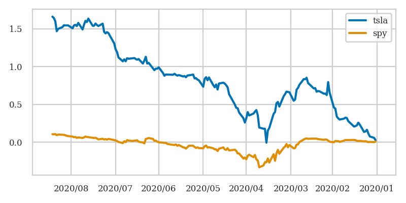
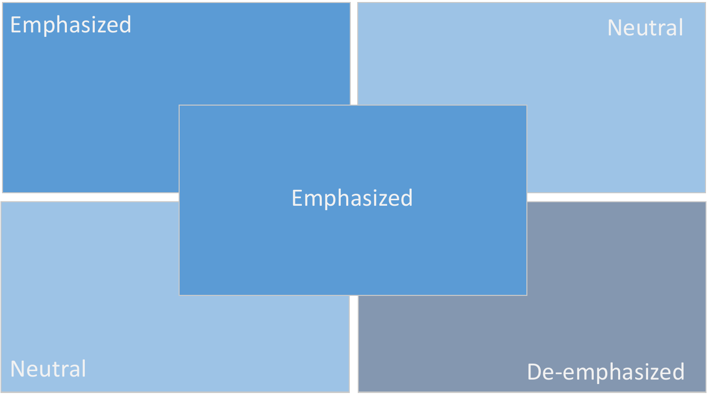
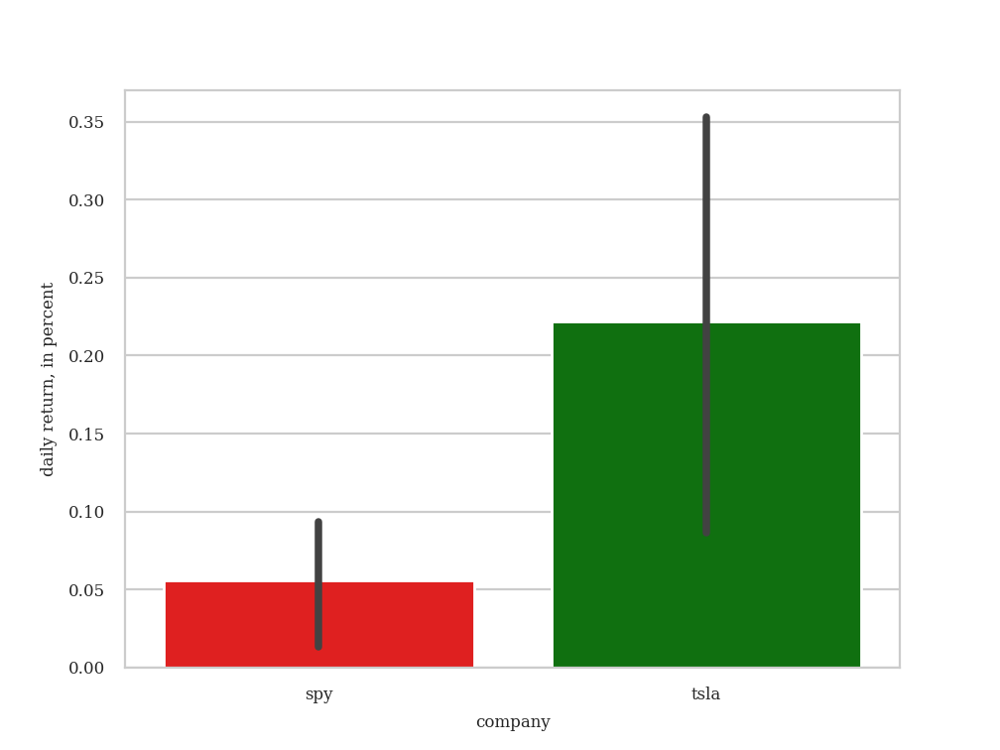
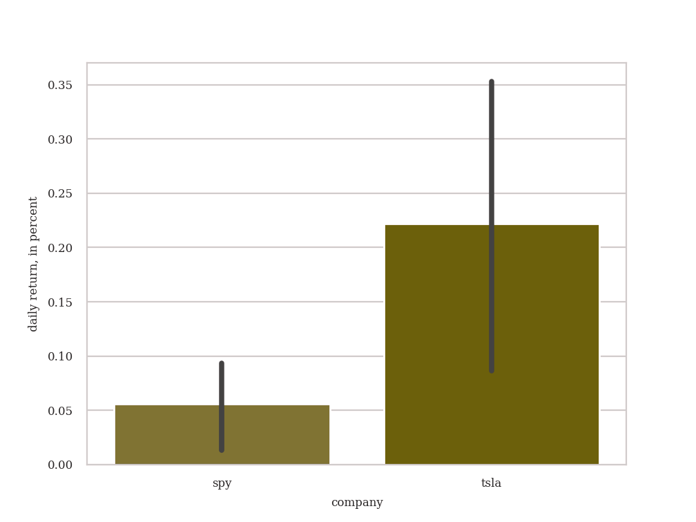
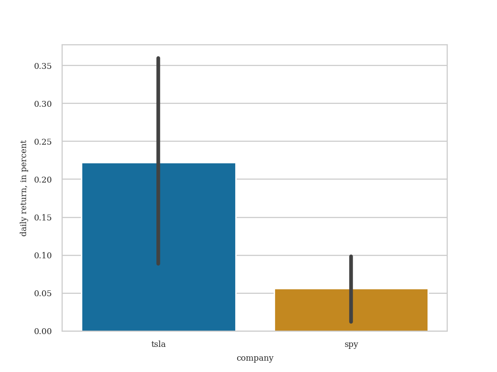
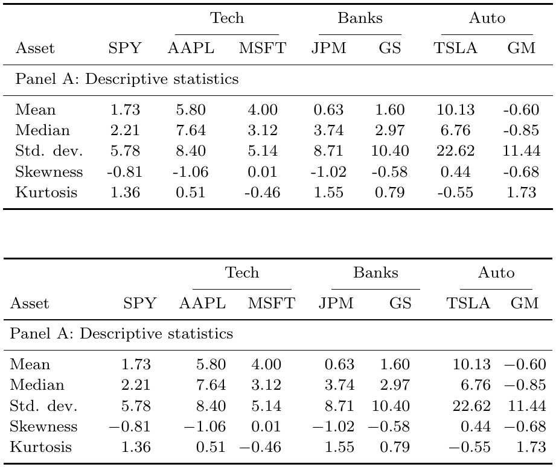
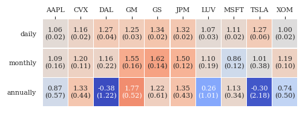
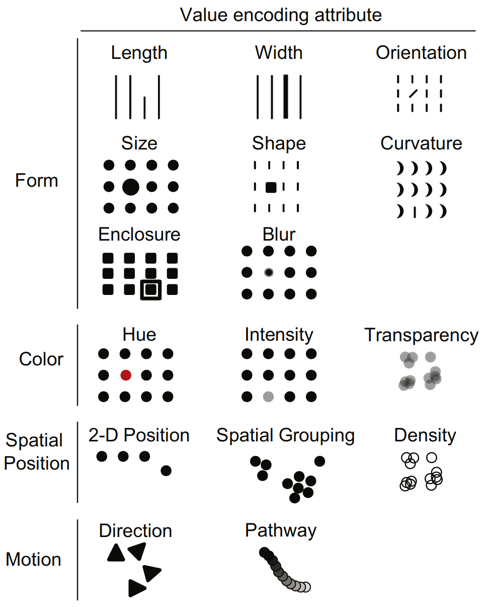
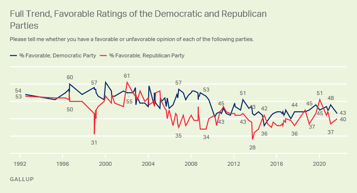

# visualization

- [visualization](#visualization)
  - [gambits of visualization](#gambits-of-visualization)
  - [how do they see?](#how-do-they-see)
    - [visual acuity](#visual-acuity)
    - [attention](#attention)
    - [colors](#colors)
  - [how do they brain?](#how-do-they-brain)
    - [patterns and pattern breakers](#patterns-and-pattern-breakers)
    - [pre-attentive attributes](#pre-attentive-attributes)
  - [technical aspects](#technical-aspects)
  - [visualization checklist](#visualization-checklist)
  - [resources](#resources)
  - [exercises](#exercises)

It is in a researcher's best interest that other people understand their work: higher clarity leads to wider recognition and more nuanced feedback &ndash; a precious commodity in scientific circles. At the same time, understanding is a hard and resource-intensive task for us humans who have evolved to excel in anything but comparing decimals and heeding values in parentheses. Thus, extra effort is required to *nudge* us into understanding.

A good first step is to present information in graphical form or supplement other means of communication with graphics. Having spent millennia as diurnal animals in hostile environments, humans rely disproportionately stronger on vision for information acquisition than on other senses and happen to be better graphics processing units than readers, listeners or smellers. Still, just showing pictures is not enough.

## gambits of visualization

At its core, visualization is a method of information compression, one of transforming what we understand poorly (e.g. lengthy series of numbers and dates) into something more conveniently digestible (e.g. a line chart). In doing so, new information such as colors, shapes etc. is being introduced, and little gambits emerge: you add bits in order to economize on bytes.

An example is overdue. Let's show how the stock price of Tesla fared relative to the S\&P500 in Jan-Aug 2020:

Here, we took two time series of numbers and replaced them with colored lines emerging from the same point of 0, all framed by a rectangle; we agreed to let the x-axis keep track of time such that values to the right refer to the past; we introduced new colors and agreed on a certain representation of dates; we put a legend in the upper right corner.

At first it may seem that we have produced more secondary information trying to convey the primary than the primary itself! But the trick here is to chose the secondary information that has already been internalized by the audience, in which case (cf memoization!) it needs not be processed anew but only be fetched from memory. This could have happened either during the presentation, or as part of the cultural upbringing, or inherited with the evolutionary baggage.

The game becomes KYA &ndash; "know your audience". Like I should have known that the standard way time is represented spatially is with the past to the left.

## how do they see?

### visual acuity

> At exactly 6 meters' distance from the patient, the letters on the 6/6 line [...] are 8.73 mm tall

> A point (pt) is equal to 0.353 millimeters

> The monocular visual field consists of central vision, which includes the inner 30 degrees of vision and central fixation, and the peripheral visual field, which extends 100 degrees laterally, 60 degrees medially, 60 degrees upward, and 75 degrees downward

The default `beamer` (the LaTeX one) font size is 11pt, which is a good value given below-average visual acuity (especially in academia), poor beamer (the device) quality and bad lighting. Avoid decreasing it.

### attention

Not all parts of the visual field subconsciously receive the same priority. Most likely because of the way we read, the upper left corner is slightly emphasized.

### colors

Color blindness is inability to distinguish colors, most frequently but not solely red and green. The latter form affects up to 8% of males and 0.5% of females: given prevalence of males in academia and finance, there is about 30% chance that among 20 audience members at least 1 person will see the following chart:

as:

## how do they brain?

Seeing is only the first part of perceiving. The information arriving through the rather straightforward optic device called eye is being continuously processed, with and without our consent. Before we even start to think about an image, the brain has already processed a great deal out of it, mostly searching for patterns and pre-attentive attributes.

### patterns and pattern breakers

As David Eagleman puts it,
> Things that are stable carry no interesting information. All the important information come from the things in flux.

It is such 'things in flux' that tend to pose a threat or present a treat, and such being the case, our brain has evolved to prioritize them when allocating resources. 'Stable' things, otherwise called patterns, are learned, compressed and stored in the subconscious to be reused at little cost. For a researcher presenting their work this means that the secondary information should be made as stable as possible to minimize the costs of its processing.

All it takes to do so is to be consistent with notation, colors, shapes etc. For instance, if from the very first slide you paint Tesla-related elements in blue and SPY-related ones in red, the audience learn this pattern and has more brain capacity to think about the higher average return of Tesla's stock price you show on the fifth slide.

Another useful pattern is the alignment of the decimal separator. Take the following two tables:

It is much easier to draw conclusions from the second table. Use LaTeX package `dcolumn` to achieve this.

### pre-attentive attributes

Some features of perception come as evolutionary baggage, such as our tendency to associate warm colors with 'good' (was helpful to discern ripe fruit from the surrounding foliage). This means you can add a layer of colors to any set of numbers in your presentation, e.g. to tables:

to make the audience understand your message better.

In the context of shapes, differences in length and 2D position are better quantitatively perceived than those in other attributes:

A lot of what we see is influenced by our cultural upbringing. Language is an obvious example here, strongly influencing our visual perception. The alphabetic order is a nice pre-learned pattern to make use of when improving searchability of lengthy lists such as column/row names and legend entries. Speakers of different languages have different perception of colors! For instance, Russians may have an easier time discriminating between shades of blue, as there are distinct words for those in everyday use ('синий' for 'blue' and 'голубой' for 'light blue').

Take colors, for example. The Democratic party of the US has blue as its primary color, while the Republican party has red. Coca-Cola is strongly associated with red, while Pepsi with blue. Whenever these are featured in your visualizations, it is a good idea to match the colors you use in the legend with what the audience subconsciously expect the colors to be.

## technical aspects
Image formats .png and .pdf are preferred to .jpeg: the latter is a lossy compression format and is likely to produce pixelated images at higher zoom ratios. A good dots per inch value is 300 for the figure size of 4x3 inches.

## visualization checklist

- font size is at least 11pt;
- pre-learned attention patterns are utilized (color meaning, alphabet);
- new easy-to-learn attention patterns are introduced (decimal separator, color association);
- palettes are colorblind-friendly;
- colors and pattern breakers accentuate important information;
- choices (colors, date formats, ordering) are as consistent as possible;
- .png and .pdf are strongly preferred to .jpeg.

## resources

- [*Nature* article on color blind-friendly visualizations](https://www.nature.com/articles/d41586-021-02696-z);
- [color blindness simulator](https://www.color-blindness.com/coblis-color-blindness-simulator);
- Financial Times ranting about chart crimes, [p1](https://www.ft.com/content/ef0a5f01-14ad-49f2-a5f6-994f65489b91), [p2](https://www.ft.com/content/ebc7d70c-0d28-4dc9-8006-de9a8be11981). [p3](https://www.ft.com/content/c81a3d20-a320-490f-86fa-13e17104fa78);
- [xkcd comic on visual fields](https://xkcd.com/1080/);
- [ten guidelines for efficient visualizations](http://dx.doi.org/10.1016/j.envsoft.2010.12.006).

## exercises

- create a table as a heatmap;
- create a line plot with at least four lines using a color blind-friendly palette;
- putting grid on plots looks like a dominating strategy: why? is it a pre-attentive attribute? a pattern?
