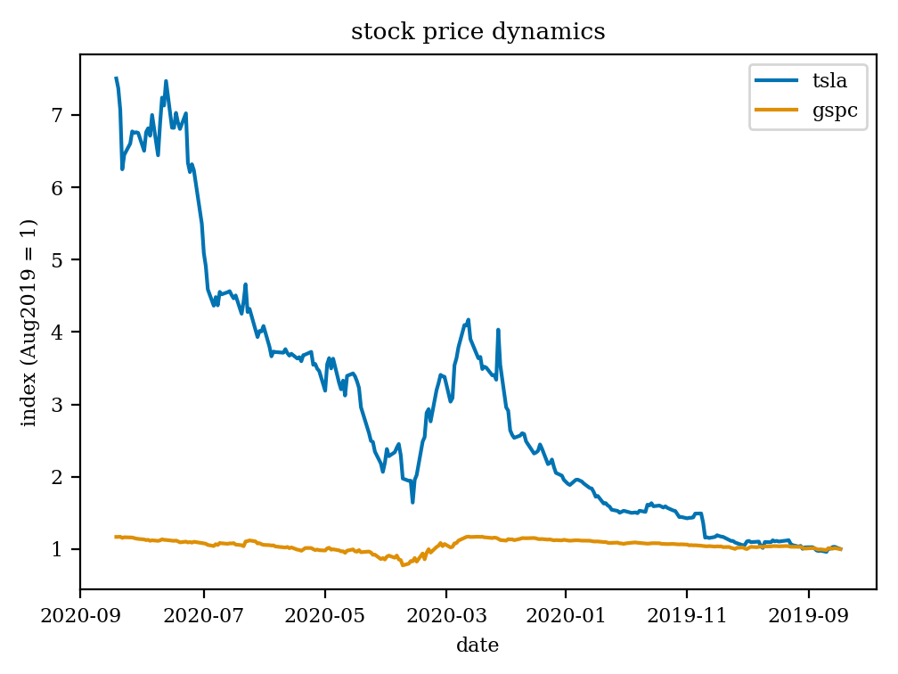

# visualization

## primary vs secondary information
Let's say you are presenting your research findings which are that Tesla has outperformed the S\&P500 index in terms of the stock price appreciation, as supported by this image:

... or is it really? As the brain of an audience member starts to make sense out of the slide, it (the brain) has to process the following:
*   the concept of a chart;
*   the concept of an index;
*   pictorial representation of time flow direction;
*   colormap;
*   date representation;
*   ...
*   \[a million other things\]
*   ...
*   the fact that Tesla has outperformed S\&P500.

The problem with the chart above is the unusual pictorial representation of time: therein it flows upwards instead of left-to-right as the overwhelming majority of us are accustomed to. This custom is by no means instinct in humans, but rather a cultural phenomenon, as certain peoples, when asked to point in the direction of time flow, would not gesture in the same left-to-right way. Anyway, had I chosen the 'usual' time flow direction, there would have been less confusion, and the brain would have spent more resources on the information that I wanted to communicate in the first place, namely, the success of Tesla.

Although rather artificial, the example highlights several things to keep in mind when visualizing research findings:
*   there is what can heuristically be called **primary** and **secondary** information on every slide;
*   the brain needs to process both;
*   brain resources are limited;
*   there are certain learned features the brain uses to economize.
