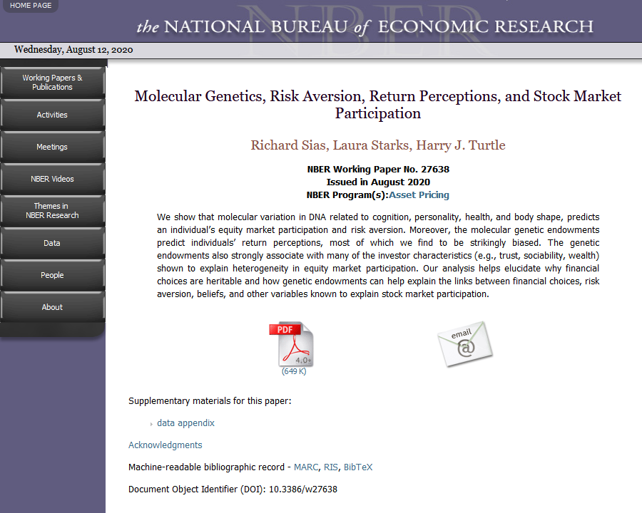

# writing with latex
<!-- TOC -->

- [basics](#basics)
- [setup](#setup)
  - [installation](#installation)
  - [packages](#packages)
  - [text editor](#text-editor)
- [workflow](#workflow)
- [document structure](#document-structure)
- [bibliography](#bibliography)
  - [structuring the database](#structuring-the-database)
  - [importing .bib files](#importing-bib-files)
  - [inserting the .bib database](#inserting-the-bib-database)
- [useful tricks](#useful-tricks)
- [beamer](#beamer)
- [resources](#resources)
- [exercises](#exercises)

<!-- /TOC -->
## basics
LaTeX is a *typesetting system* used to translate plain text into pretty documents. It separates content and form, encouraging the author to concentrate on the former, while letting the LaTeX handle the latter. You can think here of a standard author-publisher relation: Stephen King types a masterpiece on a typewriter not heedful of font sizes, header transparency, footnote separators or the like, then sends his manuscript to a publisher who handles all the above details.

> Is it a program, a language or what?

Sort of a program. It is a convenient collection of TeX macros used to format text, TeX being a lower-level typesetting system with an integrated macro scripting language. The whole game started with TeX many years ago, but for everyday use TeX is too much flexibility and too little user friendliness, so easier-to-use packaged pieces of TeX programming instructions started to appear, LaTeX being one of them. It contains pre-written routines you can use to change fonts, add section headers, insert hyperlinks etc. &ndash; without LaTeX you would have to write TeX code for every such action. Collections like LaTeX are also called *formats*.

On a higher level still, there are *TeX distributions*, which are structured collections of stuff beyond a format someone thought you might need when typesetting. A typical TeX distribution such as *MiKTeX* or *TeX Live* includes formats ( e.g. LaTeX), languages, many fonts, environments for specific tasks, helper programs such as bibliography formatters, pdf creators, even text editors and much more. Distributions differ in the degree of security (writability to certain locations, susceptibility to viral attacks), user interface (GUI or command line), platform friendliness (some work better on Windows), amount of packages installed by default and so on. We will be using [MiKTeX](https://miktex.org/) which is slightly better optimized for Windows, but suffers from security problems. If you value security too much, it is a better idea to switch to TeX Live.

Separate collections of macros, usually serving one purpose, e.g. to insert a figure, are distributed as *packages*. Packages are add-ons which fill a gap here and there. One frequently used package is *graphicx*.

See [resources](#resources) for more info.

## setup
We will be using MiKTeX distribution and write text in Sublime, compiling from within it.

### installation
A detailed guide for installing and configuring LaTeX and Sublime text can be found in the `/latex/configuring_latex_and_sublime_on_windows/` directory. A short summary for the MiKTeX part is below:

*   download MiKTeX Net Installer from [here](https://miktex.org/download), from tab 'All downloads';
*   run the installer, choose `Download MiKTeX`, then `Complete MiKTeX` when prompted;
*   run the installer again but this time choose `Install MiKTeX`, then `Complete MiKTeX`, then `Install MiKTeX for anyone who uses this computer`; in the `Install MiKTeX from` field choose the folder you previously downloaded the MiKTeX files to; choose to indeed `Install missing packages on-the-fly`;
*   (optional, but useful) [create a local TeXMF folder](https://tex.stackexchange.com/questions/69483/create-a-local-texmf-tree-in-miktex) &ndash; a folder where you would be able to *manually* install LaTeX packages (see [packages](#packages) below).


### packages
To install an additional package, e.g. [`threeparttable`](https://ctan.org/pkg/threeparttable?lang=en), just open the MiKTeX console, navigate to `Packages` tab and type in the name of the package, then click the `+` button to install it.

If you cannot see the package there, it is not part of the distribution, and you would have to install it manually. The package might come as one or a bundle of files such as `.sty`. In this case, the installation is a bit trickier, please see [this thread](https://tex.stackexchange.com/questions/2063/how-can-i-manually-install-a-package-on-miktex-windows) for reference.


### text editor
If you have not already, install Sublime and package [LaTeXTools](https://latextools.readthedocs.io/en/latest/) which gives you code completions, highlighting, inline preview, compiling from the editor and a great amount of control when LaTeXing in general.

You will also need to install [Sumatra PDF](https://www.sumatrapdfreader.org/free-pdf-reader.html) to use preview the produced .pdf files and inverse search a place in .tex from the corresponding place in .pdf. For instructions how to set up inverse search (from the .pdf to the .tex) see [here](https://latextools.readthedocs.io/en/latest/install/#windows).

Then, in the LaTeXTools package settings, navigate to section 'Build engine settings' and set 'builder' to 'basic'. Also, take time to read through what is written there. Basically, *building* is a bundle consisting of compiling the document, compiling the bibliography and producing the .pdf.

Optionally, install:
*   [ghostscript](https://ghostscript.com/download/gsdnld.html) to preview equations in SublimeText;
*   [ImageMagick](http://www.imagemagick.org/script/download.php) to preview figures (don't forget to check the box `Add application directory to your system path`).

## workflow
1. **Know your macros**. You are aware which macros produce the formats you need and in which packages those macros are to be found. For instance, multi-line equations require package *amsmath* and are inserted as follows:
```latex
\begin{gather}
...
\end{gather}
```
2.  **Write text**. Write plain text using a text editor of choice (Notepad, Sublime, Atom etc.) inserting macros to set formatting. A document might look as simple as:
```latex
\documentclass{article}
\usepackage{amsmath}
\begin{document}
\begin{gather}
	  x = 1 \\
	  y = -1
\end{gather}
\end{document}
```
3.  **Build**. To turn your collection of text and macros into a readable document, the file must be compiled by running it through a program such as `latex` (will produce a .dvi file) or `pdflatex` (will produce a .pdf). From whenever your .tex file is located, execute the following in the command line:
```
pdflatex <filename>.tex
```
to produce a readable .pdf. In Sublime with LaTeXTools installed, you can use `Ctrl+B` to build.

Observe the separation here: you write the text, then compile it &ndash; which is tantamount to having the machine typeset it.

## document structure
LaTeX documents are expected to follows a certain layout. Please take a look at the [[latex wiki]](https://en.wikibooks.org/wiki/LaTeX/Document_Structure).

## bibliography
Bibliography is a collection of all references you cite in your work. As it is in general a bad idea to type citations by hand (there are too many of those, plus several other reasons), a better idea is to organize them in a well structured database and point to its entries whenever needed. In a LaTeX document, this is achieved using two things, which you will always encounter in discussions of bibliography: a backend processor such as _biber_ and a package providing bibliography formats such as _biblatex_. The former takes a bibliography database (usually a `.bib` file) and processes it to produce a TeX-conforming file (usually with extension `.bbl`), while the latter define macros used to place a citation, give a citation an ordinal number or create a hyperlink.

We will be working with _biber_ and _biblatex_. The latter contains many possible bibliography formats, e.g. `bwl-FU`.

### structure
A bibliography database is saved as a `.bib` file and has entries of the form:
```latex
@<TYPE>{<KEY>,
  <FIELD> = {<FIELD_VALUE>},
}
```
where
*   `<TYPE>` is the type of the source, most commonly `article`, `techreport` or `book`,
*   `<KEY>` is the unique identifier of this entry to be used in text, most commonly a short memorizable string such as `cieslak2019stock` which refers to the paper by Cieslak, Morse and Vissing-Jorgensen called 'Stock returns over the FOMC cycle' published in 2019;
*   `<FIELD>` is the name of one of many fields containing information about the source, e.g. `title` and `journal`;
*   `<FIELD_VALUE>` is the field value.

Look up the bib guide in [resources](/resources) for a broad overview of the structure of .bib files.

### maintenance
Surely, it is too time-consuming to manually type in every one of hundreds of bibliography entries you want to cite. More often than not however, you would be able to find citation info in the same place as the cited piece. Look for 'Export to BibTeX' or 'Cite this item' or similar. For instance:

[https://www.nber.org/papers/w27638](https://www.jstor.org/stable/10.1086/605130 )


[https://www.jstor.org/stable/10.1086/605130](https://www.jstor.org/stable/10.1086/605130 )


`JabRef` is a nice little reference manager that helps the user collect and organize references. Among other things, it can boast an auto-collect feature based on document identifiers such as [*ISBN*](https://en.wikipedia.org/wiki/International_Standard_Book_Number) or [*DOI*](https://en.wikipedia.org/wiki/Digital_object_identifier). Take a look at the [user's guide](https://docs.jabref.org/) for more information.

### implementation
Place biblatex package import statement in the [preamble](https://en.wikibooks.org/wiki/LaTeX/Document_Structure#Preamble) of the document, not forgetting to specify the parameters:
```latex
% bibliography
\usepackage[
    backend=biber,
    style=bwl-FU,
    url=false,
    doi=false,
    eprint=false
]{biblatex}
\addbibresource{<bibliography_name>.bib}
```

And to print the bibliography, put
```latex
\printbibliography
```
where it is supposed to appear.

## useful tricks
*   package `threeparttable` and environment `tablenotes`;
*   package `dcolumn` allowing to align columns on a separator, such as the decimal dot;
*   package `endfloat` to push all figures and table to the end.


## beamer
Package `beamer` provides functionality to create presentations with LaTeX. You should now be able to guess what it does: through a plethora of macros, it redefines the geometry of the canvas to have the usual 'presentation' aspect ratio (4:3) and size of print-outs (128x96mm), allocates one page per frame, creates titles and subtitles, meaningful footers etc. A simplest layout of a beamer-style presentation is as follows:
```
\documentclass[10pt]{beamer}

\begin{document}

\author{your name goes shere}

% ---------------------------------------------------------------------------
\begin{frame}
\titlepage
\end{frame}
% ---------------------------------------------------------------------------

\end{document}

```
More elaborate examples are in the [package documentation](https://ctan.org/pkg/beamer?lang=en).


## resources
*   [What LaTeX, TeX, pdflatex are all about](https://www.texfaq.org/FAQ-texthings);
*   [LaTeX learning resources](http://www.tug.org/begin.html) (all recommended);
*   [bibliography backend processors and packages](https://tex.stackexchange.com/questions/25701/bibtex-vs-biber-and-biblatex-vs-natbib);
*   [biblatex styles](https://tex.stackexchange.com/a/325099/218467);
*   [bib guide](https://www.economics.utoronto.ca/osborne/latex/BIBTEX.HTM);
*   [fantastic biblatex cheatsheet](http://tug.ctan.org/info/biblatex-cheatsheet/biblatex-cheatsheet.pdf);
*   [beamer examples with output](http://www2.informatik.uni-freiburg.de/~frank/ENG/latex-course/latex-course-3/latex-course-3_en.html).

## exercises
1.   TODO
